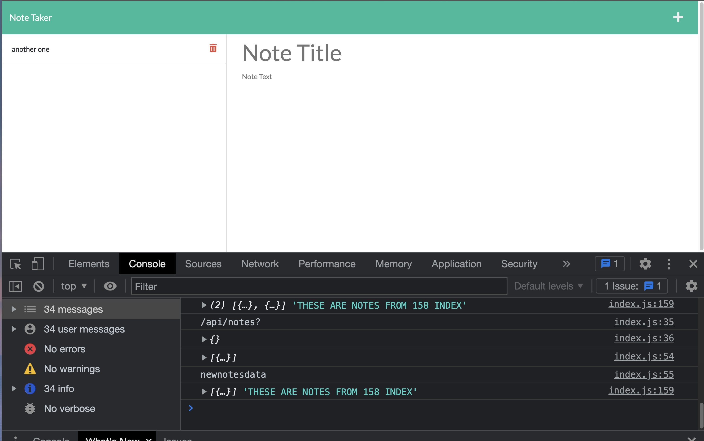
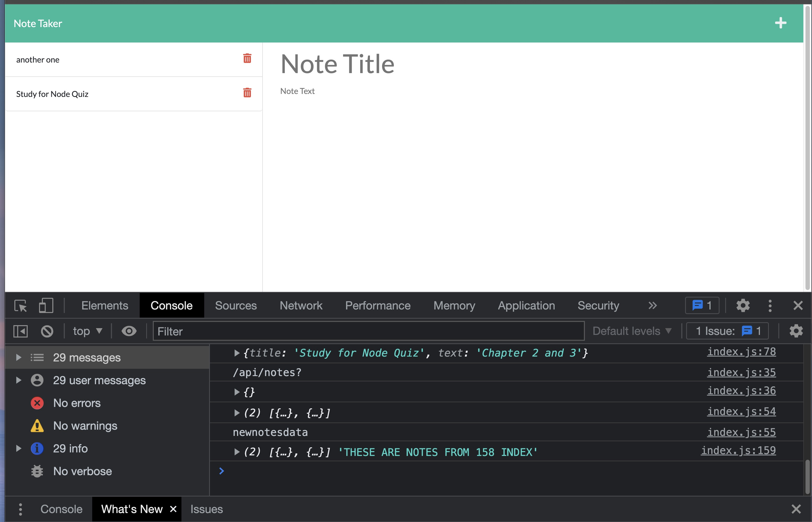

# Welcome to Save-My-Notes! 

This is an Express enabled note taking app for the user to title and save notes. The user is able to upload as many notes as they'd like and delete them. A simple and easy design to use!

### Website Link
Github URL: https://github.com/cesarsiguencia/save-my-notes
App loaded local drive: http://localhost:3002/notes

If using from local, please install Express package! Then, initiate program from the command by typing "node server" to start.
Please use PORT 3002!

### Screenshot

