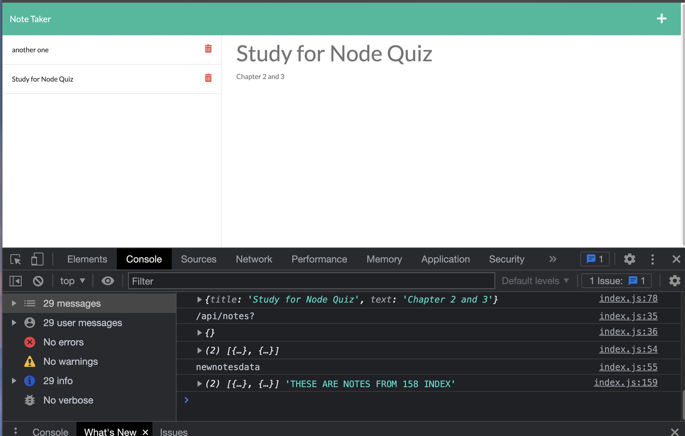

# Save My Notes

This is an Express enabled note taking app for the user to title and save their notes. The user is able to upload as many notes as they'd like and delete them at their own will. A simple and easy design to use!

Technologies used in the application are Express and the writeFile module provided by NodeJS.

To run, use the Render link below or download the application, run 'npm i' in the command line, then run 'npm start' and load the browser to http://localhost:3002

### List of API routes built

- GET (ALL notes saved in array)
- POST (ONE note)
- DELETE (One note)

### Application Link/Installation

This render link is a Free Web Service. As stated on Render's website: 

"*Web Services on the free instance type are automatically spun down after 15 minutes of inactivity. When a new request for a free service comes in, Render spins it up again so it can process the request.*

*This will cause a delay in the response of the first request after a period of inactivity while the instance spins up.*"
 
 

**PLEASE BE PATIENT WHEN LOADING THE LINK, IT SHOULD TAKE LESS THAN A MINUTE.** 

Link: https://save-my-notes-by-cs.onrender.com/

OR if downloaded locally:

1. Git clone or download the application and load on VSCode.
2. Run 'npm install' in the Command Line for all necessary packages to install.
3. Run 'npm start' and navigate to browser to http://localhost:3002

### Screenshots

